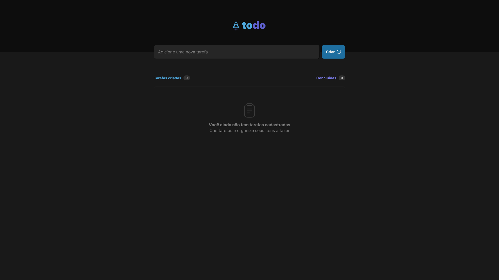
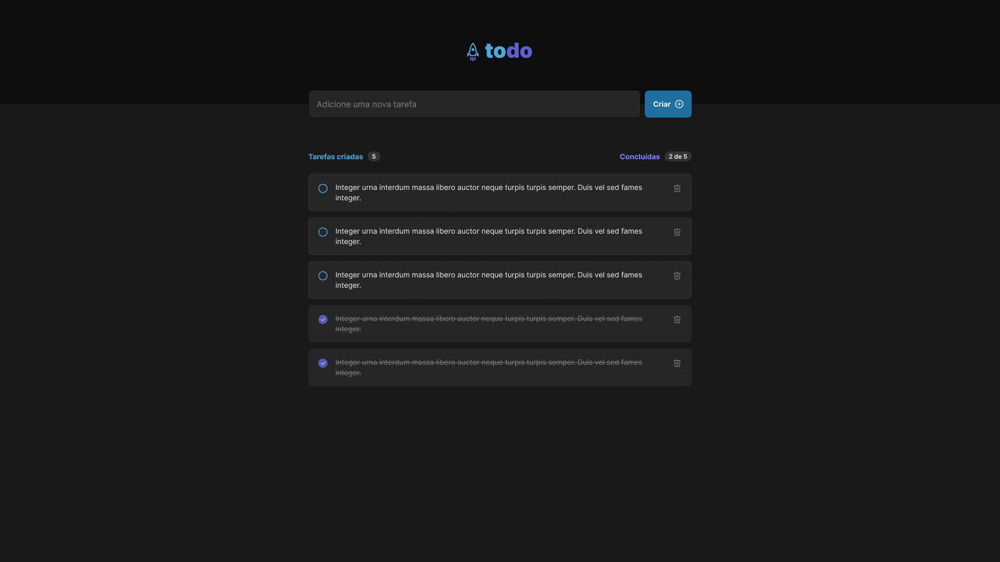

# TodoListApp

TodoListApp is a web-based task management application enabling users to create, organize and track their daily, weekly or monthly to-do lists. The application offers a user-friendly, intuitive interface that makes it easy to manage tasks efficiently and stay organized.

### Languages used

 

### Models

